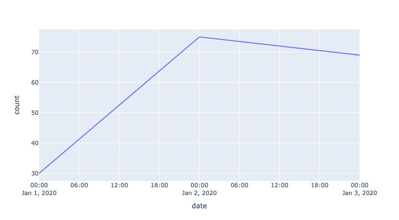
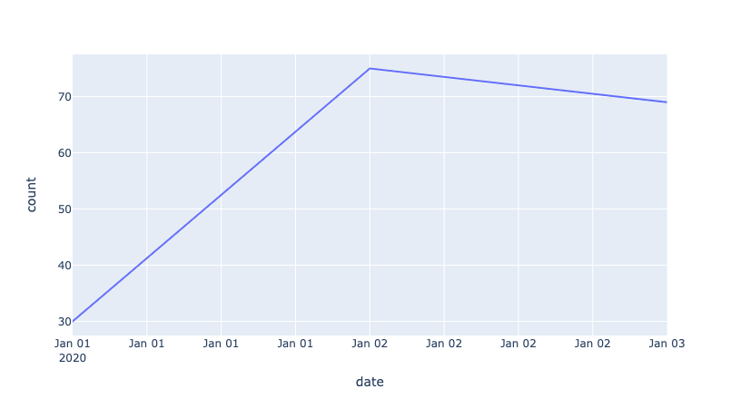
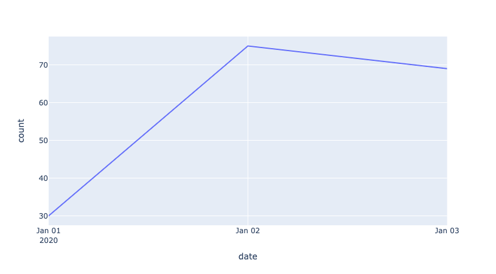

# Plotly Date Axis Formatting

Creating time series graphs with Plotly can be simple and fun! Choose between different chart types, adjust the date axis range via range sliders, or tweak the formatting further in the code. Nevertheless, you may find yourself stuck while accommodating for your exact preferences.

In this article, we will outline how a default date axis property may be undesirable in some contexts and how to work around it.

## Default Date Axis Property

When you make a chart with dates, the x-axis automatically adapts its tick labels to fit the spacing of the graph. This can also occur every time you zoom in/out of the graph. We see such adjustments for the charts below, where the dates in the provided data include year, month, day but no time (e.g. `"2020-01-01"` or `datetime.date(2020, 1, 1)`).




<!-- 
3 days | 100 days
- | - 
 |  
-->

<!-- 
<p float="center">
  
   
</p> 
-->

While this default feature is generally useful, it may not always be desirable! Notice when there are a small number of days (e.g. 3 days) along the date axis, the time also appears with the date. If the data is meant to be representative of the date and not time, but the chart implies otherwise, this can confuse the viewer.

## What Are Our Options?

You may be able to patch together a workaround from Plotly's [time series tutorial](https://plotly.com/python/time-series/), [figure reference for `layout.xaxis`](https://plotly.com/python/reference/layout/xaxis/), and/or some more Googling. For this particular case, we've noticed that almost any fix that comes to mind has its shortcomings, and so, it is worth discussing.

### 0. Disable zoom in mode bar

Your date range may never be so small such that time makes an appearance in the date axis. In either case, recall that zooming into the chart also has the same effect. 

Thus, if the zoom feature is of less importance to you, you can opt to disable zoom along the x-axis via the `fixedrange` property:

```python
fig.update_xaxes(fixedrange=True)
```

Of course, this still does not resolve when the date range is in fact small. So let us proceed!

### 1. Change tick label format

We can set the tick label format to show only day, month, and year (and thus no time) via the `tickformat` property:

```python
fig.update_xaxes(tickformat="%b %d\n%Y")
```

However, in doing so, we miss out on the default formatting for a date axis that spans between many months or years. 

Therefore, it may be better to only change the format for the zoom level at which time appears in the tick label by default. This can be specified in the `tickformatstops` property as a dictionary, where `value` is the equivalent of `tickformat`, and `dtickrange` focuses on when the tick interval is less than a day (86400000 ms):

```python
fig.update_xaxes(
    tickformatstops=[
        dict(dtickrange=[None, 86400000], value="%b %d\n%Y")
    ]
)
```

Since we only change the tick label and not the tick interval, this fix simply replaces time-specific tick labels with just dates. Unfortunately, this leaves us with repeating dates: 



### 2. Change tick interval

So why don't we simply change the tick interval to be one day (86400000 ms) via the `dtick` property? 

```python
fig.update_xaxes(dtick=86400000)
```

This works well when the date range spans a smaller number of days:


However, when the date range spans a large number of days (e.g. 100 days), the x-axis can get crowded: 


However, if you never have too many days along the date axis, this may still be a viable option for you. Otherwise, the next solution attempts to resolve this. 

### 3. Change tick interval if date range within a specified number of days

By computing the number of days in the dataframe and acknowledging a maximum number of days to have the tick interval format as a constant, you can determine whether to set `dtick` as follows:

```python
MAX_DAYS_WITH_DTICK_FORMAT = 10 # you can change this!

# compute number of days in date range of date column
max_date = pd.to_datetime(df["date"]).max()
min_date = pd.to_datetime(df["date"]).min()
num_days = (max_date - min_date).days

# set tick interval if number of days within specified limit
if num_days < MAX_DAYS_WITH_DTICK_FORMAT:
    fig.update_xaxes(dtick=86400000.0)
```

While this little hack does wonders, it is important to realize that since graph widths may vary for different screen widths, you may need to experiment to find the ideal value for `MAX_DAYS_WITH_DTICK_FORMAT`. If all goes well, we have a clean date axis with no timestamps!




<!--

Solution: convert dates to be categorical data points

Problems:
- this may not be ideal for chart types intended for continuous data (e.g. line charts)
- if one-digit month/day markers in the date do not have trailing zeros, the order of the dates could be messy
- but missing out on properties for dates (e.g. zoom out to monthly/yearly view)

-->

## Conclusion

The solution you choose will depend on your context. You may never encounter a limited date range such that time would make an appearance in the date axis unless you zoom in. You may or may not desire the zoom feature. The width of your chart, and thus the  may vary between screen devices. 

Ultimately, I think it would be ideal to define `dtick=86400000` for `dtickrange=[None, 86400000]` in a `tickformatstops` dictionary as shown below. However, `dtick` is currently not a valid property. 

```python
fig.update_xaxes(
    tickformatstops=[
        dict(dtickrange=[None, 86400000], dtick=86400000)
    ]
)
```

It is our hope that Plotly adds this feature one day. In the meantime, we hope these workarounds can be of service!
